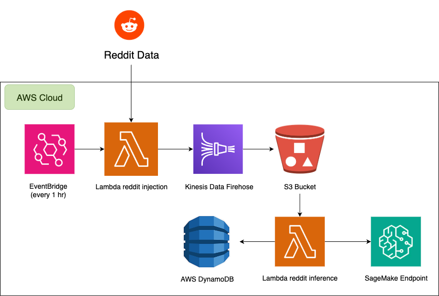
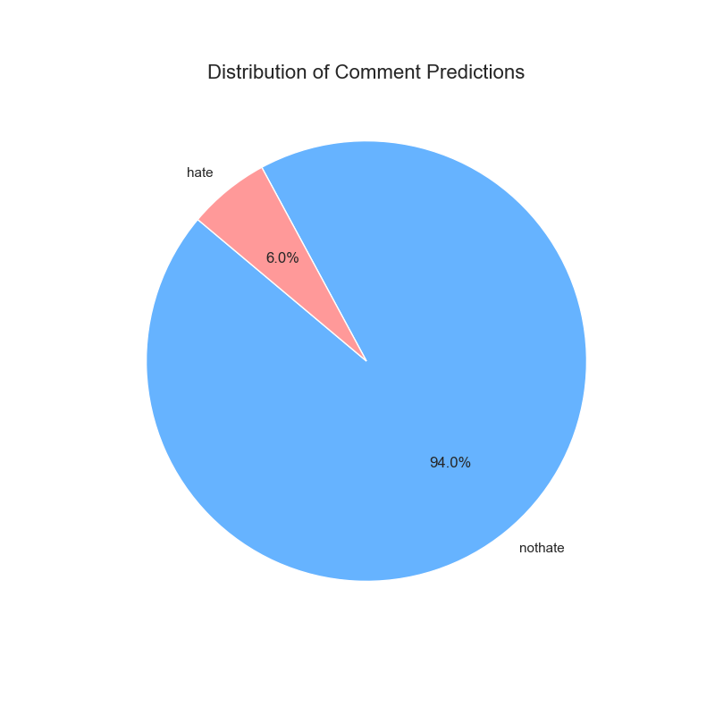

# End-to-End Serverless Hate Speech Analysis Pipeline on AWS

This project demonstrates a fully automated, event-driven pipeline for ingesting Reddit comments in real-time, analyzing them for hate speech using a serverless ML model, and storing the results for analysis.

## 🏛️ Cloud Architecture

The entire pipeline is deployed on AWS and operates without manual intervention. It is built on a serverless, event-driven architecture that ensures scalability and cost-efficiency by only running when new data is available.

### Workflow Breakdown:

1.  **Scheduled Ingestion:** An **Amazon EventBridge** rule triggers an **AWS Lambda** function every hour.
2.  **Secure Data Fetching:** The *Ingestion Lambda* securely retrieves Reddit API credentials from **AWS Secrets Manager** and fetches the latest comments.
3.  **Streaming & Batching:** Comments are pushed into an **Amazon Kinesis Data Firehose** stream, which automatically batches them into larger files and delivers them to an **S3 bucket** (our data lake).
4.  **Asynchronous Inference:** The arrival of a new data file in S3 triggers a second *Inference Lambda* function.
5.  **Serverless ML Analysis:** This function invokes a real-time **AWS SageMaker Serverless Endpoint** to classify each comment as 'hate' or 'non-hate'. Using a serverless endpoint ensures we only pay for the exact milliseconds of compute used for inference.
6.  **Structured Data Storage:** The results (comment, label, score) are stored in an **Amazon DynamoDB** table for fast, structured access.

## ✨ Key Technical Features

- **Serverless & Event-Driven:** Built a decoupled architecture using Lambda, EventBridge, and S3 Events that reacts to data, not timers.
- **Cost-Effective Serverless ML:** Deployed a Hugging Face model using a **SageMaker Serverless Inference Endpoint**, minimizing idle costs and demonstrating modern MLOps deployment patterns.
- **Secure by Design:** Implemented security best practices by using **AWS Secrets Manager** for API keys and configuring IAM Roles with least-privilege permissions.
- **Efficient Data Handling:** Used **Kinesis Data Firehose** to solve the "small file problem" by batching records before delivery to the S3 data lake.

## 📊 Data Analysis & Results

The processed data, containing the model's predictions, was exported from DynamoDB to S3. A local Jupyter Notebook (`notebooks/analysis.ipynb`) was used to connect to this data, perform analysis, and generate visualizations.

#### Distribution of Comment Predictions

#### Most Common Words in "Hate" Comments

## 🚀 How to Set Up and Run

This project relies on manual setup in the AWS Console. The key steps are:
1.  **AWS Services Setup:**
    * Store Reddit API keys in **AWS Secrets Manager**.
    * Create an **S3 bucket** and a **Kinesis Data Firehose** stream pointing to it.
    * Create a **DynamoDB table** with `comment_id` as the partition key.
    * Create the necessary **IAM Roles** for the Lambda functions and other services.
2.  **ML Model Deployment:**
    * Use the `sagemaker/sagemaker_deployment.ipynb` notebook to deploy the Hugging Face model to a **SageMaker Serverless Endpoint**.
3.  **Lambda Deployment:**
    * Create the two Lambda functions (`ingestion_lambda` and `inference_lambda`) using the code in the `src/` directory.
    * Configure the triggers: an **EventBridge** schedule for the first, and an **S3 Event Notification** for the second.
4.  **Local Analysis:**
    * Configure local AWS credentials.
    * Run the `notebooks/analysis.ipynb` Jupyter Notebook to download the processed data and generate the plots.
